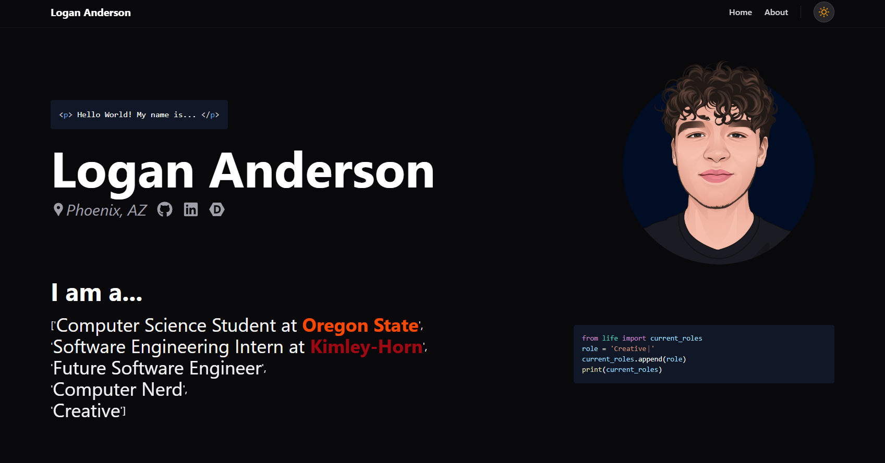

# Logan Anderson - Developer Portfolio

A premium, highly interactive developer portfolio site built using **React**, **TypeScript**, **Tailwind CSS**, and optimized 60fps animations.



## Core Features

*   **Road Progress Slider & U-Turn Physics**: A custom road-themed slider that acts as a scroll progress bar and manual seek track for projects. Features a top-down custom vector SVG sports car that performs physical Y-midpoint U-turns, changing lanes (top/bottom) and pivoting realistically based on travel direction.
*   **Smooth 60fps Carousel**: A continuous, high-performance carousel driven by `requestAnimationFrame` and React `useRef` hooks to prevent unnecessary component re-renders. Pauses automatically on project hover or slider drag.
*   **Dual-Theme Engine (Dark/Light)**: A smooth theme toggle syncing localStorage and system preferences. Uses an inline, blocking script in the document `<head>` to prevent the "flash of light theme" on page reload.
*   **Multi-Language Interactive Snippet Engine**: Showcases dynamic code snippets across **Python**, **Java**, **JavaScript**, and **C#** with VS Code-like syntax highlighting. Features a synchronized typewriter animation displaying custom developer roles inline within each language's native class or dictionary structures.
*   **Modern Aesthetics**: Premium dark/light modes, glassmorphism headers, curated typography, and responsive, fluid design principles across all viewport breakpoints.

## Technology Stack

*   **Frontend Library**: React 19
*   **Languages**: TypeScript & JavaScript
*   **Styling**: Tailwind CSS v4 & PostCSS
*   **Animations**: requestAnimationFrame (RAF) & Anime.js
*   **Bundler & Dev Server**: Vite

## Project Structure

```text
portfolio-site/
├── src/
│   ├── assets/             # Project screenshots, profile picture, assets
│   ├── components/
│   │   ├── snippets/       # Idiomatic syntax-highlighted code snippets
│   │   ├── about.tsx       # About section with code snippet workspace
│   │   ├── header.tsx      # Responsive header with theme selector
│   │   ├── home.tsx        # Hero section with animated snippets
│   │   ├── projects.tsx    # Carousel, road slider, and U-turn ticks
│   │   ├── ProjectCard.tsx # Reusable compact cards with gradient fallbacks
│   │   ├── ThemeToggle.tsx # Theme toggle animation switch
│   │   └── useTheme.ts     # System/local theme synchronization hook
│   ├── data/
│   │   └── projects.ts     # Real-world project details database
│   ├── index.css           # Global layout variables & Tailwind directives
│   └── main.tsx            # Main application entry point
├── index.html              # Inline head script to prevent light-flash
├── tailwind.config.js      # Tailwind layout setup
└── tsconfig.json           # TypeScript build definitions
```

## Getting Started

### Prerequisites

Ensure you have [Node.js](https://nodejs.org/) installed (version 18 or higher recommended).

### Installation

1.  **Clone the repository**:
    ```bash
    git clone https://github.com/lomacanderson/portfolio-site.git
    cd portfolio-site
    ```

2.  **Install dependencies**:
    ```bash
    npm install
    ```

3.  **Start the development server**:
    ```bash
    npm run dev
    ```
    Open the server URL (typically `http://localhost:5173`) in your browser to view the site.

4.  **Build for production**:
    ```bash
    npm run build
    ```
    This generates optimized assets in the `/dist` folder ready for deployment.
